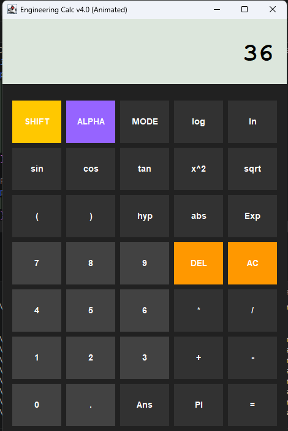

🚀 Advanced Engineering Calculator (Java Swing)

"Java" (https://img.shields.io/badge/Java-8+-orange?style=for-the-badge)
"UI" (https://img.shields.io/badge/UI-Swing-blue?style=for-the-badge)
"Status" (https://img.shields.io/badge/Project-Completed-success?style=for-the-badge)

---

📌 Overview

A high-performance Engineering Calculator built using Java Swing with a modern UI, animated buttons, and powerful scientific computation support.

This project is designed to simulate a real-world scientific calculator interface with smooth animations and expression evaluation.

---

✨ Key Features

🔹 Scientific Functions

- sin, cos, tan
- log, ln
- sqrt, power (x², xʸ)

🔹 Expression Evaluation

- Uses "exp4j" library
- Supports complex expressions

🔹 Advanced UI Design

- Dark theme professional layout
- Large touch-friendly buttons
- Monospaced LCD display

🔹 Smooth Animations

- Glow effect on hover
- Button press feedback
- Color interpolation animation

🔹 Smart Input System

- Dynamic expression builder
- Error handling system
- Clean output formatting

---

🖼️ Output Screenshot

«📸 Add your screenshot in "images" folder»

---

🧠 Technologies Used

- Java (Swing & AWT)
- exp4j (Expression Evaluation)
- Event-driven Programming
- UI Animation using Timer

---

⚙️ How to Run

🔹 Compile:

javac -cp "exp4j-0.4.8.jar" AdvancedCalculator.java

🔹 Run:

java -cp ".;exp4j-0.4.8.jar" AdvancedCalculator

---

📁 Project Structure

Advanced-Calculator-Java/
│── AdvancedCalculator.java
│── exp4j-0.4.8.jar
│── README.md
│── images/
    └── calculator.png

---

💡 Highlights

✔ Real-time expression solving
✔ Professional calculator UI
✔ Interactive button animations
✔ Clean and maintainable code structure

---

🚀 Future Enhancements

- 📊 Calculation history panel
- 💾 Memory functions (M+, M-)
- 🌗 Dark/Light mode toggle
- ⌨️ Full keyboard input support
- 📱 Responsive layout (mobile-like UI)

---

👩‍💻 Author

Komal Dhamange

---

⭐ Support

If you like this project, give it a ⭐ on GitHub and share it!

---
